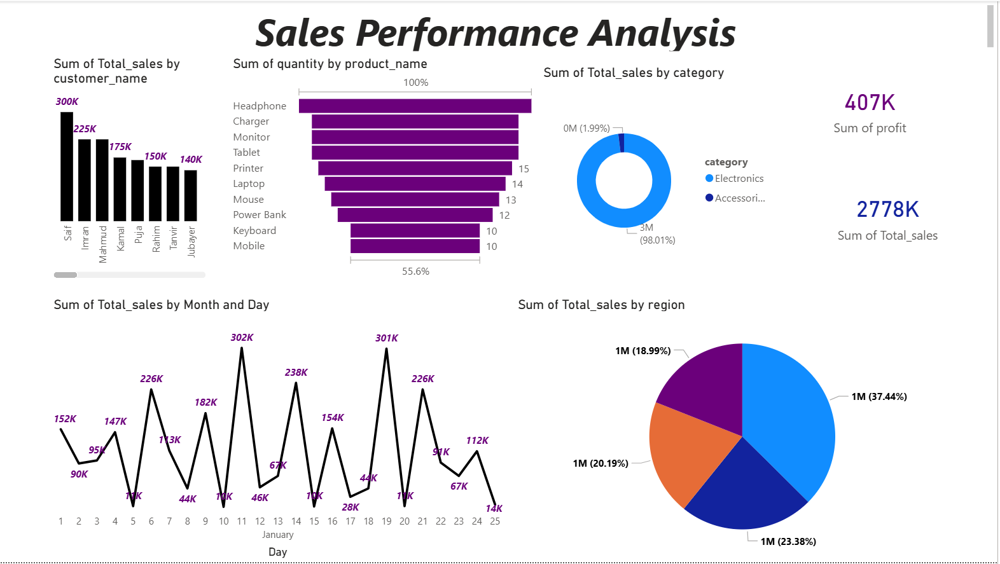

# Sales Performance Analysis Project

## 📌 Project Overview
This project focuses on analyzing sales data to evaluate business performance, identify trends, and generate actionable insights using SQL, Excel, and Power BI.

The objective of this project is to understand how sales vary by time, product, and region, and to help decision-makers improve revenue and profitability.

---

## 🛠 Tools Used
- SQL (Data querying and analysis)  
- Microsoft Excel (Data cleaning and preparation)  
- Power BI (Dashboard and visualization)  

---

## 📂 Dataset
The dataset contains sales-related information such as:
-Customer_name	
-country	
-product_name
-category	price	
-order_date	
-quanatity

 

The data was cleaned and structured before analysis.

---

## 📊 Key Analysis
- Total sales and total profit  
- Monthly and daya sales trends  
- Top-selling products  
- Sales by region
- Sales by category   
- Customer by top performance 
- Identification of low-performing and high-performing products  

All analysis was performed using SQL queries.

---

## 📈 Dashboard
An interactive Power BI dashboard was created to visualize:
- Overall sales performance
- Top customers Sales  
- Sales trend month & days  
- Regional sales distribution  
- Top 5 Product-wise performance  
- Profit analysis  

Dashboard file: `Sales Performance Dashboard.pbix`

---

## ▶ How to Use
1. Open the Excel file (`Sales Performance.xlsx`) to view the dataset.  
2. Run SQL queries from `Sales Performance.sql` in your SQL environment.  
3. Open the Power BI file (`Sales Performance Dashboard.pbix`) to explore the dashboard.

---

## ✅ Skills Demonstrated
- SQL querying  
- Data cleaning  
- Data analysis  
- Data visualization  
- Business insight generation  
- Dashboard creation
## 📊 Dashboard Preview

